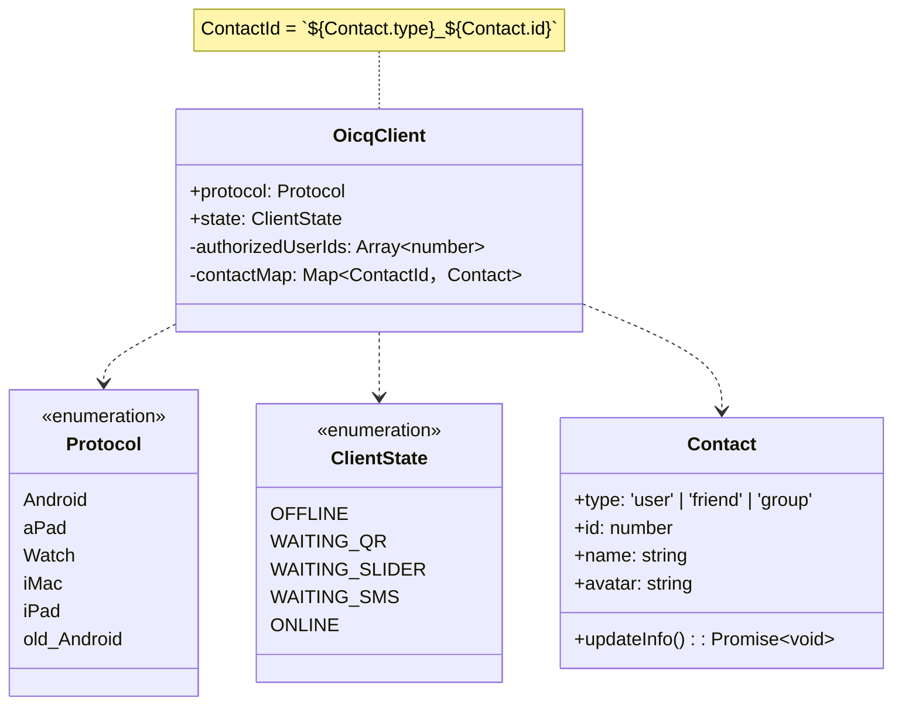
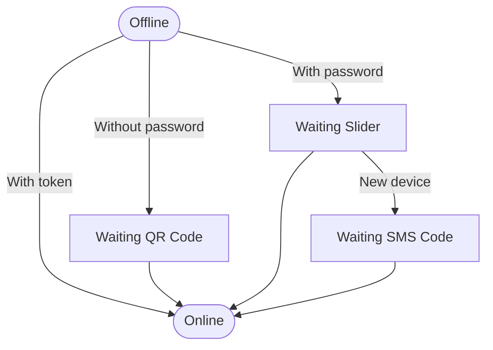

## `class` OicqClient

### Overview

```mermaid
classDiagram
    OicqClient ..> Protocol
    OicqClient ..> ClientState
    OicqClient ..> Contact
    note for OicqClient "ContactId = `${Contact.type}_${Contact.id}`"
    class OicqClient {
        +protocol: Protocol
        +state: ClientState
        -authorizedUserIds: Array~number~
        -contactMap: Map~ContactId，Contact~
    }
    class Protocol {
        <<enumeration>>
        Android
        aPad
        Watch
        iMac
        iPad
        old_Android
    }
    class ClientState {
        <<enumeration>>
        OFFLINE
        WAITING_QR
        WAITING_SLIDER
        WAITING_SMS
        ONLINE
    }
    
    class Contact {
        +type: 'user' | 'friend' | 'group'
        +id: number
        +name: string
        +avatar: string
        +updateInfo(): Promise~void~
    }
```

### Login States

```mermaid
flowchart
    offline([Offline])
    qr[Waiting QR Code]
    slider[Waiting Slider]
    sms[Waiting SMS Code]
    online([Online])

    offline -->|With token| online
    offline -->|Without password| qr --> online
    offline -->|With password| slider --> online
    slider -->|New device| sms --> online
```